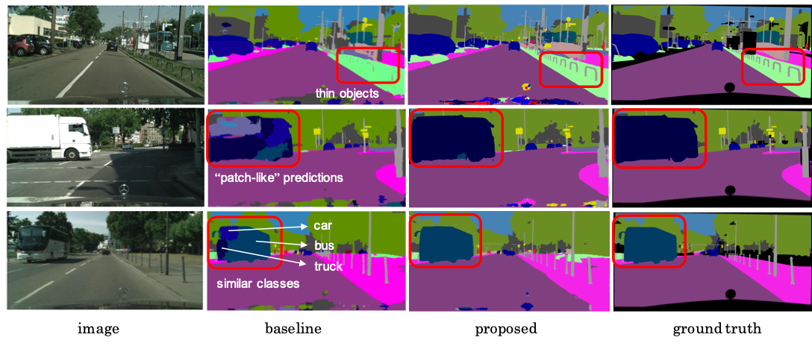
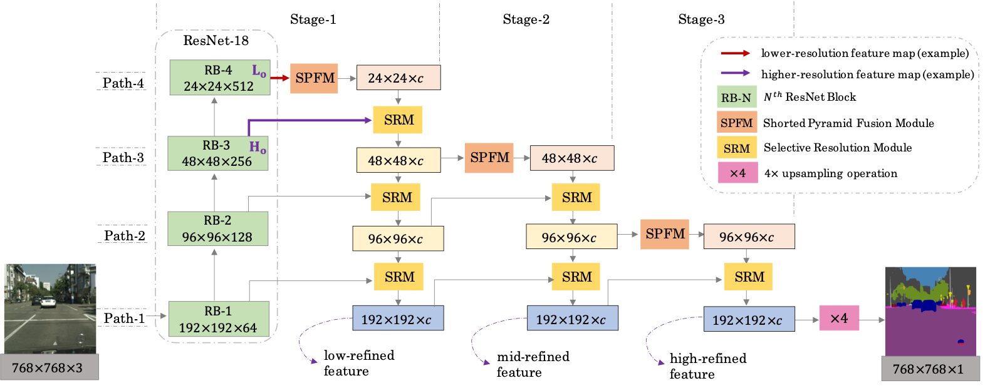

# CSRNet


Cascaded Selective Resolution Network for Real-time Semantic Segmentation. 

Since real-time segmentation approaches tend to exploit lightweight networks, they mainly face three problems. 
- The poor performance in segmenting small structures like thin “poles”. 
- The “patch-like” predictions in the interior of the dominant objects. 
- Some classes with similar shapes and appearances, like car, bus and truck are confusing in classification. 
To alleviate these problems, we propose a multiple-stage segmentation network, CSRNet to refine the feature maps progressively. 


The overall process of the proposed system.
<p align="center"></p>

Segmentation comparison.
<p align="center"></p>


## Dependencies
- Python 3.6
- PyTorch 1.5.0
- CUDA 10.2 
- cuDNN 7.6.5

The experiments are conducted on a Ubuntu 18.04 LTS PC with two NVIDIA GeForce GTX 1080 Ti. Driver version is 460.91.03. GCC version is 7.5.0. Please refer to [`requirements.txt`](requirements.txt) for more details about the packages used.


## Installation
- Clone this repository.
```
git clone git@github.com:Mayy1994/CSRNet.git
```
- Create a virtual environment and install the required python packages.

## Dataset setup

Please download the [Cityscapes](https://www.cityscapes-dataset.com/downloads/) dataset.


## Training

